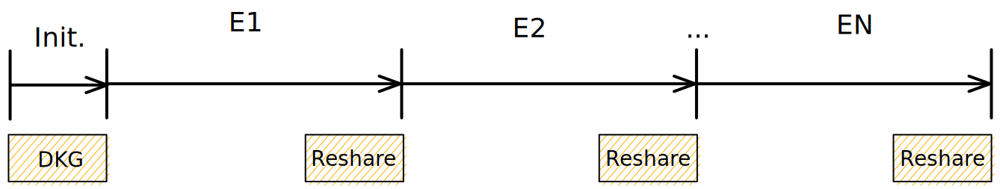
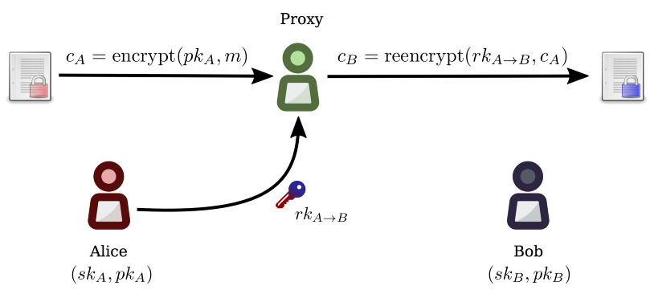
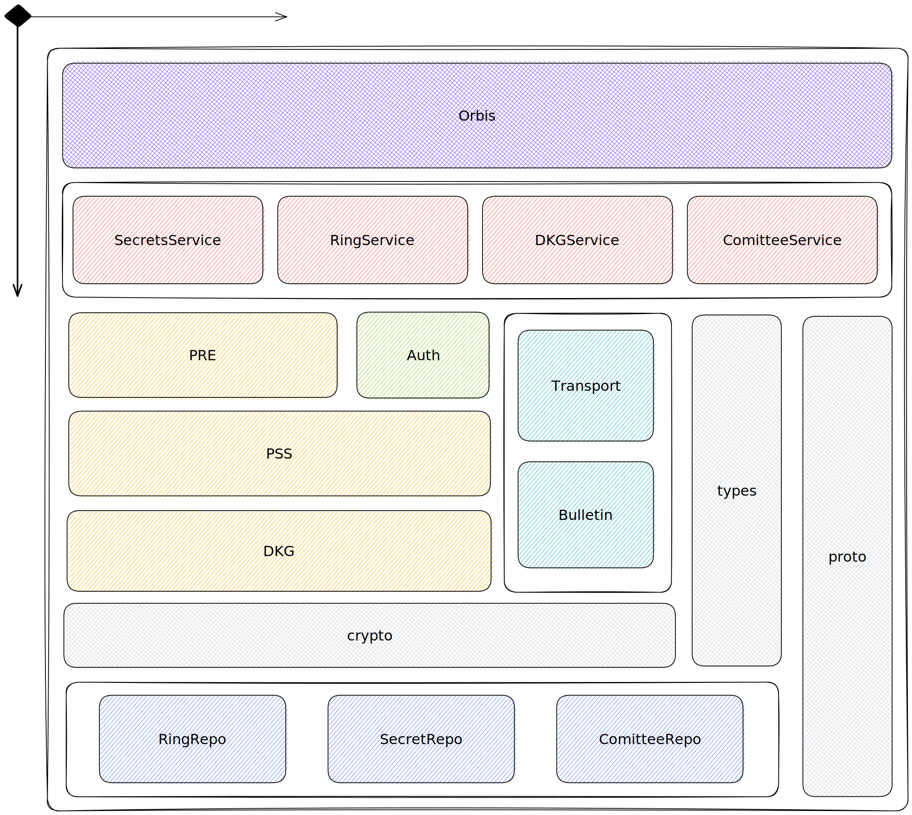

# Orbis - Secrets Management Engine

Orbis is a hybrid secrets management engine designed as a decentralized custodial system. A hybrid decentralizec custodial system is one where it acts as a single "custodial" service that is the owner and authority of a secret, but is maintained by a decentralized group of actors. Any one actor in the system is unable to recover or access the owned secret, instead a threshold number of actors is required to coordinate to recover the managed secret.

However, instead of directly recovering the secret, which would reveal the plaintext to the actors in the system, instead, we apply a form of encryption that prohibits the system from *ever* accessing the plaintext of your secret, called Proxy Re-Encryption (PRE). PRE Translates encrypted ciphertext from one public key to another without exposing the plaintext.

## Status
This project is still early in its architectual journey. Although the overal high-level design and goals are defined, the concrete implementation details are in flux.

## Decentralized Custodial
Traditional centralized custodial secrets management engines like [Vault](https://www.vaultproject.io/) or [AWS KMS](https://aws.amazon.com/kms/) are designed for traditional cloud deployments with no byzentine or malicious faults. Moreover, as they are centrally owned and operated, there is a single authority that is responsible for maintaining and diseminating managed secrets. This deployment works in the private application specific deployment that cloud-native applications thrive in. However, for the purposes of public permissionless use case the centralization is a single point of failure, censorship, and X. 

The solution to the centralized custodial system is a decentralized variant. Instead of relying on authority for security like in the centralized version, the decentralized version must be grounded in verifiable cryptograhic and byzentine fault tolerant primitives.

## Secret Ring
Secret Rings are the decentralized group of actors that collaboratively maintain a shared keypair for the purposes of secrets management.

These shared keypairs are generated via a DKG algorithm and maintained by a PSS algorithm for long term security. Together DKG and PSS provide a mechanism for nodes to collaboratively generate a shared keypair with the public key known to all, but the private key known by none. Instead the private key is split into "shares" where each node holds a share.

Users who want their secrets managed by a given secret will encrypt their secret `s` using the Secret Rings public key, along with a Proof of Encryption, and a authorization policy to protect it.

Once stored by the SecretRing, no single node may access the underlying secret `s`. When a user wants to recover the secret, they submit a read request which contains an ephemeral public key, and a Proof of Authorization for the given policy.

When a SecretRing recieves a read request, they verifiy the Proof of Authorization, and initiate a Proxy Re-Encryption of the secret `s` with their share of the private key `sk_i` (`i` denotes the ith node in the ring), and the provided ephemeral public key. This step produces a PRE share, which when recovered yields a `ReKey_AB` which is cryptographic key for migrating ciphertext between two public keys `A` and `B`- where `A` is the SecretRing public key, and `B` is the requesting ephemeral public key.

Once a threshold number of peers correctly generate and publish their PRE share, either the requesting reader on their local device, or a delegated node can recover the `ReKey_AB`, apply the final re-encryption step, and recover the original secret `s` by decrypting it their local private key associated with the requesting ephemeral public key.

### Authorization
Each secret `s` will have an associated `policy` that determines under what conditions a requesting party can access the secret. This is a relatively abstract design of Orbis.

The end goal is to delegate authorization to the [CACP]() engine on the SourceHub, which is a Zanzibar-style system.

## MPC
The core design of Orbis relies on a various kinds of Multi Party Computation (MPC) systems that enable cryptographically secure, verifiable, and byzentine fault tolerance.

### DKG
Distributed Key Generation is a decentralized method of a collection of nodes to collaboratively generate a cryptographic keypair, where the public is known by all, but no single node knows the private key. Instead each node maintains their "share" of the private key, and a threshold number of nodes can compute the secret key.

### PSS
Proactive Secret Sharing is an auxiliary algorithm to that of the DKG. Once a DKG has been initiated and the associated keypair generated, the committee of can only tolerate up to a threshold number of currupted, malicious, or otherwise byzentine nodes. If the time scale for how long one or more adversaries need to exploit these nodes is unlimited, that likely hood of such instance goes to 100%. 

PSS allows us to solve the unbounded time property by introducing a bounded time, where any adversary who is timebound to `T` cant effectively currupt or exploit the necessary threshold numbers of nodes in `T-1` time. By *proactively* recomputing each nodes share of the private key, without actually changing the underlying long term keypair of the DKG, we can ensure any timebound adversary will never recover the private key.

This is achieved by dividing time into *epochs* of time `T`, and intiating a *proactivization* ReShare protocol at the end of each epoch before starting the next. This ReShare protocol should still only require a threshold number of honest nodes, as well as being able to dynamic change the comittee and theshold size.

### PRE
Proxy Re-Encryption is a very powerful cryptographic primitive that allows one to generate a special `ReKey` that transforms/migrates ciphertext that is encrypted under one public key `A` to another public key `B`. Moreover, the responsibility of actually applying the re-encryption given the rekey `rk_AB` can be executed by a non-trusted server, without ever being able to recover the original plaintext.

## Architecture

### Diagram

### Packages

- `/orbis` - Top level entry that combines all the sub packages into a single coherent system.
- `/pkg` - 
  - `/auth` - Authorization interfaces. Implementations will include SourceHub ACP, ZK-KMS, and local Zanzibar.
  - `/bulletin` - Public (verifiable) broadcast "bulletin board" for posting to and reading from in a peer-to-peer context.
  - `/config` - Top level configuration objects
  - `/crypto` - Cryptographic utilities
  - `/db` - Database, key-value, and repo interfaces
  - `/pre` - Proxy Re-Encryption interfaces. Implementations include ElGamal RPE in the semi-trusted server domain.
  - `/pss` - Proactive Secret Sharing. Implementations include AVPSS (eventually CHURP, ECPSS)
  - `/service` - Top level service interfaces, of which all the other components provide for.
  - `/transport` - Networking transport layer interfaces. Implementations include basic LibP2P system.
  - `/types` - Types shared by several components and packages
- `/proto` - Protobuf definitions. Primarily used for network message and database serialization
- `/gen` - Generated types based on the Protobuf definitions.

## References
> TODO

## Authors
- John-Alan Simmons ([@jsimnz](https://github.com/jsimnz))